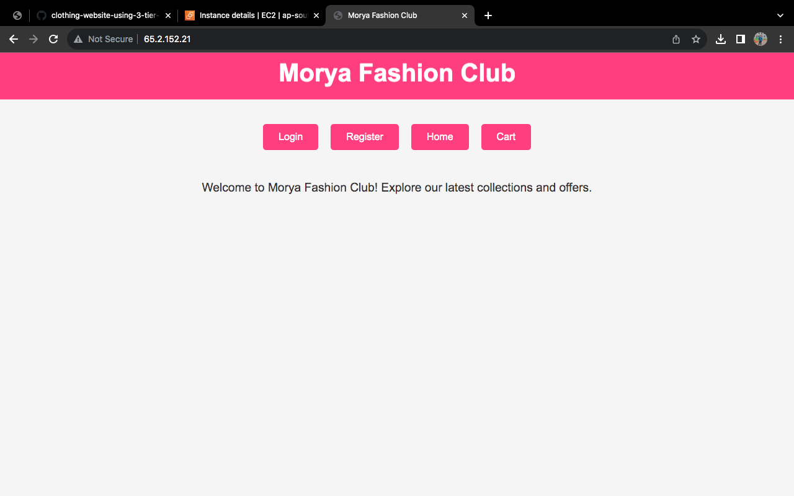

# Clothing Website using 3-Tier Architecture

A simple clothing store web app where users can browse/search items, view details, add to cart, and place orders. The infrastructure is deployed using a 3-tier architecture on AWS: using VPC, EC2, and RDS.

---

## Table of Contents

- [Architecture](#architecture)  
- [Tech Stack](#tech-stack)  
- [Folder Structure](#folder-structure)  
- [Setup Instructions](#setup-instructions)  
  - [Prerequisites](#prerequisites)  
  - [AWS Infrastructure](#aws-infrastructure)  
  - [Deploying Application](#deploying-application)  
- [Usage](#usage)  
- [Screenshot](#screenshot)  
- [Contributing](#contributing)  
- [License](#license)

---

## Architecture

Here’s the high-level 3-tier architecture of this project:

- **Presentation Layer**: Public EC2 instance hosting HTML/CSS/Front-end (index.html, shop.php) accessible over the internet.  
- **Application Layer**: Private EC2 (if used) handling business logic / form handling / processing.  
- **Database Layer**: RDS MySQL instance in private subnet; only accessible from the App layer.

Other components:  
- VPC with 3 subnets: public, private application, private database.  
- Security groups to restrict access: only necessary ports, minimal exposure.  
- No public access for RDS; private instances have no public IP.  
- NAT gateway or other mechanism if private instances need outbound internet (for updates) — (if configured).

---

## Tech Stack

| Component        | Technology                     |
|------------------|----------------------------------|
| Front-end        | HTML, CSS                     |
| Back-end         | PHP                            |
| Database         | MySQL (RDS)                   |
| Hosting / Infra  | AWS (VPC, EC2, RDS)            |
| Local development| VS Code                        |

---

## Folder Structure

/
├── Images/
│ └── (screenshots, product images)
├── index.html # main page / homepage
├── shop.php # product listing + add to cart
├── order.php # view cart & place order
├── style.css # styles for pages
├── sql-setup/ # schema + sample data for DB
│ └── schema.sql
└── README.md # this file

---

## Setup Instructions

### Prerequisites

- AWS account  
- IAM user with sufficient permissions (EC2, RDS, VPC, Security Groups)  
- SSH key pair for EC2  
- MySQL client (optional, for local access/checks)  

### AWS Infrastructure (3-Tier Setup)

### **Step 1: Create VPC & Subnets**
 
1. Go to **VPC Console → Create VPC**

   * Name: `3tier-vpc`
   * CIDR Block: `10.0.0.0/16`
2. Create **Subnets**:

   * **Public Subnet**  → Name: `public-subnet`
   * **Private Subnet (App)**  → Name: `private-app-subnet`
   * **Private Subnet (DB)**  → Name: `private-db-subnet`
3. Create **Internet Gateway (IGW)**

   * Attach it to `3tier-vpc`
4. Update **Route Tables**:

   * Public Route Table → Add Route → `0.0.0.0/0` → Target: IGW
   * Associate Public Route Table with `public-subnet`
   * Private Route Table → No direct internet access 

---

### **Step 2: Launch Public EC2 (Web Server)**

1. Go to **EC2 Console → Launch Instance**
2. AMI: Amazon Linux 2
3. Instance type: `t2.micro` (free-tier)
4. Network settings:

   * Select VPC: `3tier-vpc`
   * Subnet: `public-subnet`
   * Auto-assign Public IP: ENABLE
5. Security Group:

   * Allow HTTP (80) from `0.0.0.0/0`
   * Allow SSH (22) from your IP
6. Launch → Download Key Pair
---

### **Step 3: Launch Private EC2 (App Server)**

1. Go to **EC2 Console → Launch Instance**
2. Same AMI (Amazon Linux 2)
3. Instance type: `t2.micro`
4. Network settings:

   * VPC: `3tier-vpc`
   * Subnet: `private-app-subnet`
   * Auto-assign Public IP: DISABLE
5. Security Group:

   * Allow SSH (22) from Public EC2 Security Group 
   * Allow Custom TCP  from Public EC2 
6. Launch → Connect via SSH through **Bastion/Jump Host** (your Public EC2)
7. Install Application Server (Node.js, PHP, etc.)

---

### **Step 4: Create Database (RDS)**

1. Go to **RDS Console → Create Database**
2. Engine: MySQL (or PostgreSQL)
3. DB instance class: `db.t3.micro`
4. VPC: `3tier-vpc`
5. Subnet group: Select `private-db-subnet`
6. Security Group:

   * Allow MySQL/Aurora (3306) **only from App Server Security Group**
7. Disable Public Access
8. Create Database

#Website view

